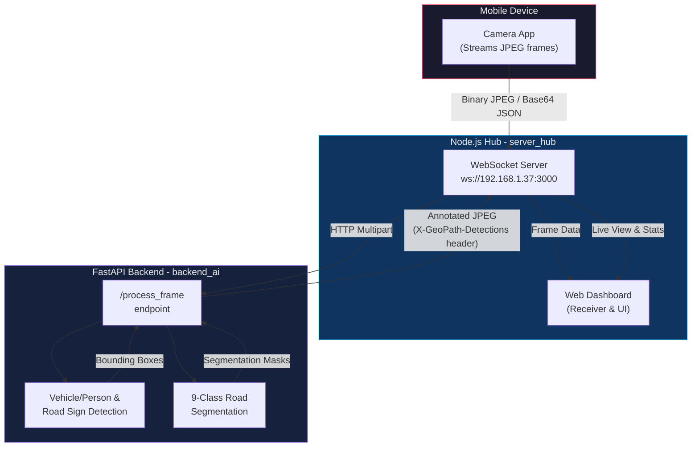

# GeoPath — Real-Time Road-Scene Monitoring Dashboard

<p align="center">
  
  
  
  
  
  
  
  
</p>

GeoPath is a local road-scene monitoring dashboard. It combines YOLO road segmentation with vehicle/person and road-sign detection, displays annotated camera frames, and tracks class counts in a browser interface.

> *"Connect your mobile camera, stream frames to the local network, and get real-time road segmentation and object detection with live class-count tracking."*

---

## System Architecture



---

## Models

The backend loads these checkpoints from the project root:

- **Road segmentation:** `models/Road segment/models/best_yolo26_seg.pt`
- **Vehicle/person detection:** `models/Vehicle_Person_YOLOv26/yolov26_vehicle_person/train_exp/weights/best.pt`
- **Road-sign detection:** `models/Road_Sign_YOLOv26*/best_detector.pt`

> **Note:** The road-sign directory is discovered using the `Road_Sign_YOLOv26*` prefix because the current directory name contains a trailing space. The detector searches that directory for `best_detector.pt`.

### Detected Classes

| Model | Classes |
|-------|---------|
| **Road Segmentation** | `road`, `pothole`, `road_damage`, `divider`, `outer_lane_marking`, `middle_lane_marking`, `zebra_crossing`, `waterlogging`, `speed_breaker` |
| **Vehicle/Person Detection** | `person`, `bicycle`, `motorcycle`, `car`, `auto_rickshaw`, `bus`, `truck`, `tractor` |
| **Road-Sign Detection** | `traffic_sign` |

---

## Requirements

- macOS or Linux
- Python 3.14 (or a Python version supported by the installed PyTorch and Ultralytics wheels)
- Node.js and npm
- A browser with camera access; allow permission when prompted
- All three model checkpoint files listed above

---

## Setup

Run commands from the project root.

Create and install the backend environment:

```sh
python3 -m venv backend_ai/.venv
backend_ai/.venv/bin/python -m pip install -r backend_ai/requirements.txt
```

Install the dashboard dependencies:

```sh
npm ci --prefix server_hub
```

---

## Run

Start each service in a separate terminal from the project root.

**Terminal 1: AI Backend**
```sh
backend_ai/.venv/bin/python -m uvicorn backend_ai.main:app --host 192.168.1.37 --port 8000
```

**Terminal 2: Web Dashboard and WebSocket Hub**
```sh
node server_hub/server.js
```

On this network, open the dashboard at <http://192.168.1.37:3000> and the API documentation at <http://192.168.1.37:8000/docs>. Stop either service with `Ctrl+C` in its terminal.

---

## Camera Integration

The dashboard is a receiver and does not request camera permission directly. Connect the separate mobile camera app to `ws://192.168.1.37:3000` on the same network. Send frames as binary JPEG messages for both the RGB display and AI processing.

JSON frame messages and raw data-URL/base64 text are also supported for the RGB display.

**Supported JSON payload fields:** `frame`, `image`, `data`, `base64`, `payload`, `imageData`, `frameData`, `jpeg`, and `jpg`.
- Payloads may be base64 strings, byte arrays, or Node Buffer JSON objects.
- A `frame`, `camera_frame`, `video_frame`, or `image` type is also recognized.

Access the dashboard at its local HTTP address. The rear-camera panel is a placeholder and does not currently capture a second stream.

---

## Processing Modes

The AI camera page has two independent controls:

- **Vehicles, people & road signs:** runs both detection checkpoints.
- **Road segmentation:** runs the nine-class segmentation checkpoint.

Both are enabled by default. The backend endpoint also accepts `mode=both`, `mode=det`, `mode=seg`, or `mode=none`:

```text
POST http://192.168.1.37:8000/process_frame?mode=both
```

Send the frame as multipart form data under the field name `file`. The response body is an annotated JPEG; detected class counts are returned in the `X-GeoPath-Detections` response header as JSON.

## Docker

Build and run the combined image from the project root:

```sh
docker build -t amitchauhanai/geopath:latest .
docker run --rm -p 3000:3000 -p 8000:8000 amitchauhanai/geopath:latest
```

Open the dashboard at `http://<host-ip>:3000`. The mobile camera connects to `ws://<host-ip>:3000`.

### Example cURL

```bash
curl -X POST http://192.168.1.37:8000/process_frame?mode=both \
  -F "file=@frame.jpg" \
  -o annotated_frame.jpg \
  -D headers.txt
```

*(The `headers.txt` file will contain the `X-GeoPath-Detections` JSON stats, and `annotated_frame.jpg` will contain the processed image.)*

---

## Project Structure

```
GeoPath/
├── backend_ai/
│   ├── main.py              # FastAPI backend, YOLO inference logic
│   ├── requirements.txt     # Python dependencies
│   └── .venv/               # Virtual environment
│
├── server_hub/
│   ├── server.js            # Node.js WebSocket hub & dashboard server
│   └── package.json
│
├── models/
│   ├── Road segment/
│   │   └── models/
│   │       └── best_yolo26_seg.pt
│   ├── Vehicle_Person_YOLOv26/
│   │   └── yolov26_vehicle_person/
│   │       └── train_exp/
│   │           └── weights/
│   │               └── best.pt
│   └── Road_Sign_YOLOv26*/  # Note the trailing space in directory name
│       └── best_detector.pt
│
└── README.md
```

---

## Thanks for Exploring!

Thank you for checking out **GeoPath**. I hope this project demonstrates an effective pipeline for real-time road-scene analysis, combining instance segmentation and object detection on edge/local networks. If you found this useful, feel free to give it a ⭐ on GitHub or share it with others!

**Amit Chauhan**<br>
[amitchauhanai@icloud.com](mailto:amitchauhanai@icloud.com)

---

<p align="center">
  <b>One stream — road conditions segmented, objects detected, and stats tracked in real-time.</b>
</p>